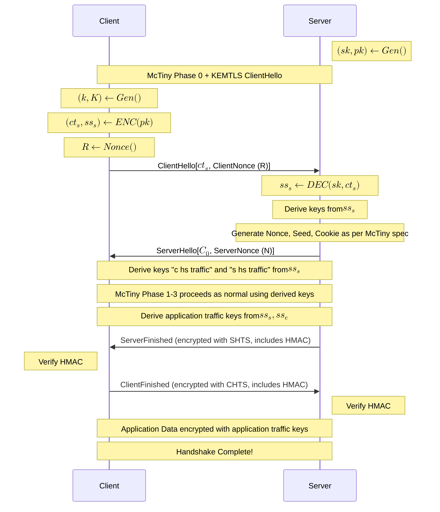

# KEMTLS with McTiny
Coursework for COMSM0042 Advanced Cryptology, University of Bristol

GitHub Repository: [github.com/bristermitten/kemtls](https://github.com/bristermitten/kemtls)


## Task

We aim to combine the [McTiny](https://mctiny.org/) protocol for efficiently performing Classic McEliece Key Exchange within [KEMTLS](https://kemtls.org/), a post-quantum extension of TLS that uses KEMs instead of Diffie-Hellman & Signatures.

## Terminology

The McTiny and KEMTLS papers use different names for their parameters, keys, and shared secrets. Since McTiny was implemented first, and then KEMTLS, there might be some inconsistencies within the source code.

For clarity, here are some of the synonymous names used

| McTiny Name | KEMTLS Name | Description                                                                     |
| ----------- | ----------- | ------------------------------------------------------------------------------- |
| $sk$        | $sk_S$      | Server's Static Secret Key                                                      |
| $pk$        | $pk_S$      | Server's Static Public Key                                                      |
| S           | $ss_S$      | Static Shared Secret generated from $ENC$-apsulating server's static public key |
| Z           | $ss_e$      | Ephemeral Shared Secret                                                         |

## Design Problems

- KEMTLS `ClientHello` wants us to send $pk_e$ but it's too big (>1MB), could be used by attacker to exhaust server memory
- **Solution?** so we do the McTiny-ing in `ClientHello` phase
- this introduces a new problem: the mctiny flow generates both shared secrets at once
  - we have less control over eg the keys we use for which encryption
  - the order of encryption is different - KEMTLS expects most initial messages to be encrypted with the ephemeral shared secret, whereas Mctiny encrypts everything with the static shared secret
  - is this a problem?
    - sort of. it means that until we have derived $ss_e$, we don't have perfect forward secrecy (as an attacker who recorded the traffic and later compromised the static key could decrypt everything up until this point)
    - therefore we should only send the bare minimum up until this point
    - solution: rearrange packet order, for example send `EncryptedExtensions` later

## Plan

- We merge the McTiny Phase0 with the KEMTLS ClientHello phase
  - `ClientHello` contains the encapsulation of the server static key ($ct_s$) instead of the ephemeral public key ($pk_e$), along with `ClientRandom` which is used as the McTiny nonce R
  - server responds with `ServerHello` containing the cookie $C_0$ encrypted with the static shared secret ($ss_s$), plus its own `ServerRandom`/Nonce N
- then the McTiny flow continues as normal with 1 difference:

  - we use the KEMTLS KDF to derive keys from the ss_s instead of the McTiny constant shared secret S

    - I don't think this adds much security but it means that the different flows are more clearly separated and matches the KEMTLS spec better

    - **Details**:
      - `Reply0` (i.e. `ServerHello`) is encrypted with just $ss_s$
      - both parties derive $dES$ from $ss_s$
      - then both parties can derive CHTS and STCS keys from $dES$ and $ss_s$ - NOT $ss_e$ like KEMTLS would
      - [Query/Reply][1/2/3] are encrypted with CHTS and STCS as normal

- We use TLS version 0x03AC to indicate that this isn't a standard TLS Server and only supports KEMTLS with McTiny

  - 03 looks like the TLS major version
  - AC = Advanced Cryptology :)

- To simplify the implementation we only support pre-distributed keys, which McTiny also assumes
  - adding support for certificates would be possible but is out of scope of this proof-of-concept

**AEAD**: While TLS tends to use AES-GCM or CHACHA, we will use XSalsa20 + Poly1305 as in McTiny for consistency. All KEMTLS messages sent under this scheme reuse the McTiny nonce system of $[N/M] || a || b$. Specifically, it uses the suffix $0xFFFE$, as this doesn't clash with any other nonces used in McTiny as far as I can tell. Since TLS packets are already identified by their record headers, we can safely reuse nonces like this. This means that `[Client/Server]Random` are replaced with `[Client/Server]Nonce`. 

### Sequence Diagram



## Downgrade Resilience

KEMTLS provides downgrade resilience in the same way that TLS 1.3 does: by having both parties send an HMAC-ed transcript of all the TLS packets they've sent & received so far. This is done in the `ServerFinished` and `ClientFinished` packets respectively. The `ServerFinished` message includes all packets up to (but not including) the `ServerFinished` message in its transcript. The `ClientFinished` is expected to include all messages including the `ServerFinished`.

This verifies that a man-in-the-middle cannot intercept the client's messages and say that they only support a weaker algorithm (this is practically impossible with our implementation as the only supported KEM is McTiny 6960119)

One important thing to note is that we do not include McTiny packets within the transcript. 

This is because the McTiny packets are not really compatible with the TLS packet structure, most notably due to their use of the cookie values. The cookies are opaque binary values containing the server's internal state, including the (unimplemented) cookie expiry/refresh data. Including these in the transcript would make the transcript incredibly fragile and prone to breaking.

Furthermore, including it would not bring any benefits.
The goal of the handshake is to avoid downgrade attacks, which could only be performed in the initial TLS packets (ClientHello/ServerHello). Once the McTiny flow starts, both parties have already agreed on using KEMTLS with McTiny, and all packets are authenticated, and thus any tampering would be detected.

## Code Structure


### Development Setup

The easiest way to verify the implementation is with the provided Docker Compose setup. This builds the project in a Linux container and runs both the server and client, setting up all necessary dependencies automatically.

```bash
mkdir state

docker-compose up --build
```

This should show logs of the `init`, `server`, and `client` services. The `init` service runs first to generate the server static keypair, which is saved to the `state/` directory on the host machine. The server then starts up, loading the static keypair from disk, and finally the client connects to the server and performs the KEMTLS handshake.

#### Manual Setup
Alternatively, you can build and run the project manually. This requires having GHC and Cabal installed, along with a C compiler for building the McTiny C library. I can't guarantee this will work on all platforms, or even at all as I've not tested it much.

```bash
# build the mctiny C library
cd mctiny
make
cd ..

# make sure the Haskell project can find the mctiny library
export LD_LIBRARY_PATH=./mctiny:$LD_LIBRARY_PATH
export DYLD_LIBRARY_PATH=./mctiny:$DYLD_LIBRARY_PATH

# build the Haskell project
cabal build

# initialise the server static keypair
cabal run kemtls-initialise

# start the server (in a separate terminal)
cabal run kemtls-server

# start the client (in a separate terminal)
cabal run kemtls-client
```

You should see logs of the server starting up and the client connecting and performing the handshake.


The environment variable `KEMTLS_HOST` can be set to change the host the client connects to (default is `127.0.0.1`).

### Executables

The project provides 3 executables:
- `kemtls-initialise` - Sets up the server static keypair and saves it to disk, emulating a pre-distributed key setup
- `kemtls-server` - Runs the KEMTLS server
- `kemtls-client` - Runs the KEMTLS client

These can all be run with `cabal run <executable>`.
`kemtls-initialise` must be run first to generate the server static keypair.

The server must be started before the client.

The code for these executables is in the `app/` directory.

### Library

The `src` directory contains the library code, which is shared by all platforms. 

Most modules should contain documentation comments explaining their purpose.

Modules of particular note:
- `McTiny.hs` - native bindings to the McTiny implementation and nice Haskell wrappers around them
- `Packet.hs` - all McTiny packet definitions and encoding/decoding logic
- `Packet/TLS.hs` - KEMTLS packet definitions and encoding/decoding logic
- `Packet/Generic.hs` - abstraction over packets


### McTiny C Library

The pre-written McTiny C library caused some issues during the initial stage of development. It delegated much of its crypto implementation to the SUPERCOP library, which provides highly optimised implementations of various post-quantum algorithms. As this often included assembly macros, it was not compatible with all platforms, notably ARM Macs. 

The solution to this involved modifying the library and replacing the SUPERCOP calls with direct calls to the reference implementation of Classic McEliece provided by [PQClean](github.com/pqclean/pqclean). The `Makefile` was also heavily modified to remove all SUPERCOP-related build steps and be more portable.

These modifications were tested by running the McTiny test executable along with the McTiny client/server executables to ensure that the functionality remained intact.

Due to a minor incompatibility between the two libraries, these changes subtly broke the client/server implementation, causing packets to be incorrectly formed by the client. As my library delegates to some of the McTiny library, this also causes my implementation to break in a similarly subtle way. Fixing this broke the test executable. Rather than spend (any more) hours trying to debug this, this is left as-is as an acceptable compromise for this proof-of-concept implementation. (If you're curious, the issue seems to be that PQClean's headers for length constants differ slightly. Specifically, `crypto_kem_mceliece6960119_CIPHERTEXTBYTES` seems to sometimes be expected to be 194, the length of the pure ciphertext, and sometimes 226, the length of the pure ciphertext + the authentication header).

To be explicit, this does not affect our implementation. This section is only included as a note of a development challenge. 

This modified version of the McTiny library is included in the `mctiny/` directory.


## Limitations

### Cookies 
As previously mentioned, the McTiny implementation does not do cookie rotation. If we were using UDP, this might mean the server is vulnerable to replay attacks. However, since we use TCP, we do not need to design with packet loss or reordering in mind, and thus the server only accepts packets in the expected order. This means that replayed packets will be either ignored or rejected. 


### Pre-distributed Keys
The biggest limitation of this implementation is that it only supports pre-distributed keys. Adding support for certificates would be likely require significant changes to the McTiny protocol, as the certificate would need to be sent and verified before the McTiny flow begins. Classic McEliece cannot be used for signatures, so a separate signature scheme would need to be used. This is out of scope for this proof-of-concept implementation.

### Limited TLS Implementation

The bare minimum of TLS functionality and packets (ClientHello, ServerHello, ServerFinished, ClientFinished, Application Data) are implemented. A more reliable implementation would include McTiny in its supported cipher suites message, and implement this McTiny + KEMTLS as a proper TLS extension.

### Reducing Round Trips and Packet Sizes

While we merge the ClientHello with McTiny Phase 0, there is potential room for further improvements. The size of a public key fragment could be increased thanks to the guarantee of reliable delivery provided by TCP, reducing the number of fragments needed. Additionally, it might be possible to merge some of the McTiny packets with KEMTLS packets to reduce the overall number of round trips. However, these optimisations are left for future work.


# Generative AI Disclaimer

Generative AI was used in the assistance of fixing and understanding the `mctiny` C library. This primarily included modifying the `Makefile` to remove all the SUPERCOP optimised building, which was incompatible with my M1 Mac, and making it build more reliably across platforms. Boilerplate within the `bridge.c` and a few other C files was also generated with the help of AI.
McTiny's test executable was run to ensure this did not break any functionality.

Other tedious and finnicky tasks not directly relevant to the task such as writing Dockerfiles and Nix expressions were also assisted by AI.

All other code, including all Haskell code and the design of the protocol integration, was done without the assistance of AI.

# Planning Notes

_Information I noted down while developing which isn't formally presented but might still provide some useful insights into the thought process_

## High Level Points

- KEMTLS needs 2 shared secrets

  - 1 generated from ephemeral keypair
    - client generates ephemeral kp, sends pk_e to server
    - server does encap, sends ct_e
    - client does decap to get ss_e
  - 1 generated from server static keypair
    - client knows server static pk_s
    - client does encap, sends ct_s
    - server does decap to get ss_s

- McTiny covers:
  - client generates kp_e and stores it
  - client encaps server static pk pk_s to get ct_s and ss_s
  - server decaps ct_s to get ss_s
  - client sends pk_e in parts to server
  - eventually server can generate ss_e
  - sends ct_e back to client
  - who decaps ct_e to get ss_e

### Encryption

#### KEMTLS

- pk_e sent unencrypted
- ct_e sent unencrypted, certificate sent encrypted with K_1 derived from ss_e
- ct_s sent encrypted with K_1' derived from ss_e
- subsequent messages encrypted with keys derived from both ss_e and ss_s

#### McTiny

- extensions sent encrypted with ss_s
- ct_e sent unencrypted
- c_0 sent back encrypted with ss_s
- everything else is encrypted with keys derived from ss_s
